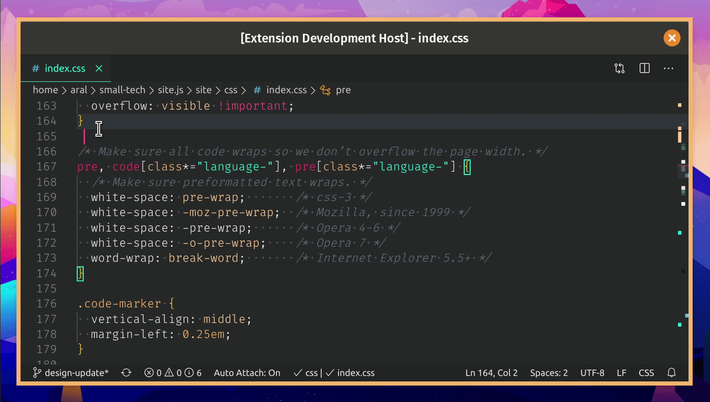

# Comment Out CSS

A Visual Studio Code and [VSCodium](https://vscodium.com/) extension that enables you to comment out sections of your CSS even if they contain comments.

Basically, it adds the ability to have nested comments in CSS to VScode (and VSCodium).

## Usage

1. Select an area of CSS to comment out.
2. Press `Ctrl + /` (macOS: `Cmd + /`), or select `Comment Out CSS` from the command menu.

The command will toggle between commenting out and uncommenting your selection.

## Limitations

  - Can only toggle the status of one commented-out block at a time.
  - Can not comment out a selection that contains only part of a regular CSS comment.
  - You must select the area to be commented (simply having the cursor within a block is not enough).

## Like this? Fund us!

[Small Technology Foundation](https://small-tech.org) is a tiny, independent not-for-profit.

We exist in part thanks to patronage by people like you. If you share [our vision](https://small-tech.org/about/#small-technology) and want to support our work, please [become a patron or donate to us](https://small-tech.org/fund-us) today and help us continue to exist.

## Copyright

&copy; 2020 [Aral Balkan](https://ar.al), [Small Technology Foundation](https://small-tech.org).

## License

[AGPL version 3.0 or later.](https://www.gnu.org/licenses/agpl-3.0.en.html)
